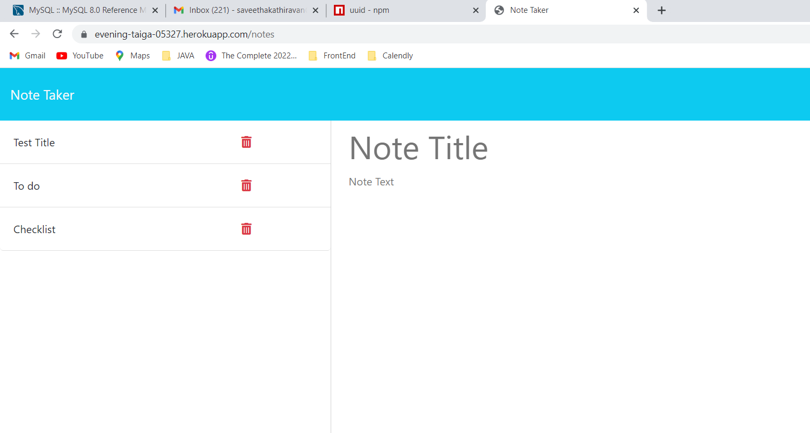

# NoteTaker

## Description

Note Taker is an application that can be used to write,save and delete notes which will use an Express.js back end to save and retrieve note from a JSON file.

## Technologies Used

 * JavaScript
 * Node.js
 * NPM
 * Express

## Usage

 

## Link to Github Repository

https://github.com/saveetha17/NoteTaker.git

## Link to Deployed Application

https://saveetha17.github.io/NoteTaker/

## Link to Heroku

https://evening-taiga-05327.herokuapp.com/notes

